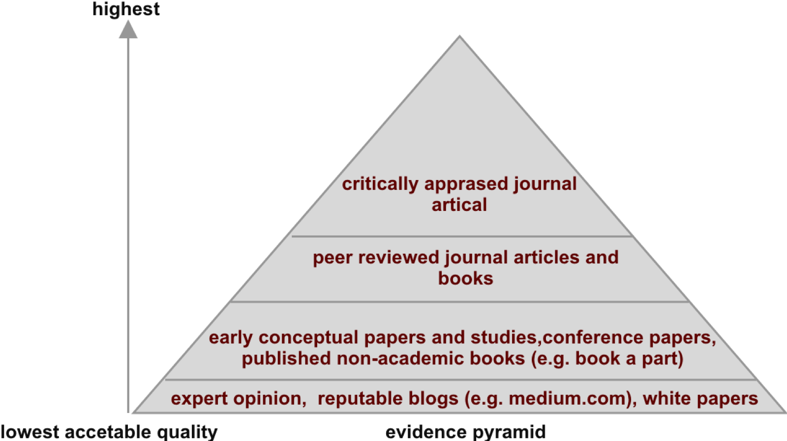
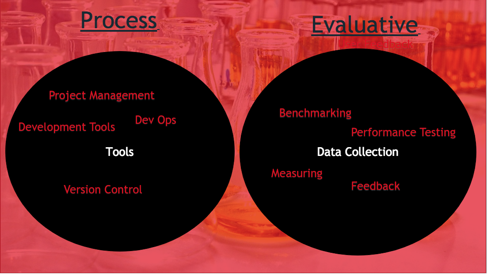

# Planning your final year project

I (Joe Appleton), at the time of writing, must have marked close to 100 final year projects. The number one, aspect that separates a satisfactory piece of work to an outstanding one, is upfront planning. 

A well planned out project will logically flow. It leads the reader to clear conclusions that are derived from carefully thought out data collection methods. The methods allow for a given research question or hypothesis to be answered.  In turn, the hypothesis or research question would have been developed to explore or solve an interesting problem statement. The whole process can be summarised as follows:

|                                   |                                                                                                                                                                              |
| --------------------------------- | ---------------------------------------------------------------------------------------------------------------------------------------------------------------------------- |
| Section                           | Reason                                                                                                                                                                       |
| Problem statement                 | The problem you are trying to solve. You should provide evidence that the problem exists                                                                                     |
| Literature Review                 | Allows you to place your study in the context of the wider scientific body of work.                                                                                          |
| Research Questions or  Hypotheses | Should allow you to address the problem statement                                                                                                                            |
| Methodology                       | The tools and techniques used to manage the project and gather key pieces of data that will allow for logical and reasoned responses to the research question or hypotheses. |

>> Table 1, An overview 

Before you start your project you should carefully consider how the above pillars of research will interlink in your research. 

## Problem Statement 

Before we can dive in and come up with a hypothosis/research question we should have a clearly articulated problem statement (i.e something that our research will address or solve). 

A problem statement should conform to the following points:

- Identify a problem
  - That you find interesting 
  - That aligns to the literature 
- Provide clear evidence that the problem exits
- In what setting have you observed the problem
- Articulate how the research will address the problem
- Use tentative, non commercial language

With the above points in mind, let's consider a example problem statement:

### Example

>> In the United Kingdom, it has been estimated that scamming causes up to £10 billion worth of damage every year (Lonsdale et al. 2016). Today’s scams come in many different forms that are constantly changing, which makes it more difficult for people to detect what is legitimate and what is not (Nkotagu 2011). Scamming incident rates are not extremely high, however the financial and mental consequences caused by them can be devastating (Modic 2012).

>> University students in particular are faced with a variety of scams which can have devastating effects, considering students are less likely to verify online information compared to people who are not students (Metzger, Flanagin and Zwarun 2003). Kleitman, Law and Judy (2018) highlight the importance of increasing awareness and competence when attempting to reduce susceptibility to phishing scams.
[...]
>> Combining an easily accessible platform with a problem that needs more awareness may help in reducing the costs, trauma and vulnerability caused by scamming. This is where the idea for a scamming progressive web application was formed. This study explores the use of a  Progressive Web Application to raise student’s awareness about the latest and most common scams that students are faced with.

The above problem statement clearly sets the context and demographic of the research - which are university students. Evidence is provided in the form of good quality citations. Finally, a proposed solution, creating a progressive web application, is presented. I really like this example, it presents all of the key pieces of information in a simple readable way.  While it uses tentative language (e.g. "may help in reducing the costs, trauma and vulnerability caused by scamming"), it also presents compelling reasons to read the research by highlighting scale of the problem of scamming and the need for a solution.  

### Issues to avoid

While a problem is simple in appearance, there are some common issues that you should avoid:

- Do not be too ambitious. You only have a limited amount of time. Be realistic about what can be achieved in this period 
- Ensure you do not select a demographic that is too broad (e.g. All social media users)
- Attempt to make a commercial product. Such an endeavour does not align with an academic project and is beyond the scope of what can be achieved. 

## Literature Review

The literature review will form an essential part of your final year project. It is the process of searching, critically appraising and interpreting literature that relates to your research topic. In doing so you will be positioning your research against a backdrop of wider studies.

Many of you would have already conducted a pilot literature review as part of your second year Graduate Professional Development unit.    [You can find an in-depth guide in my archived notes from last year](https://solent-gpd.firebaseapp.com/literature_reveiw_protocal.html#prior-to-conduction-your-literature-review), which saves me revisiting it here. I would, however like to add some context. 

>> Figure 1 

You should always try and locate, in a non biased manner, the highest quality sources. Figure 1 represents a hierarchy of sources. It is in the form a pyramid. As you navigate upwards, sources become less available, but are of higher quality.  You should mostly be focusing on the top two levels, which consist of peer reviewed journal articles. 

## Research Question/Hypothesis  

### What Makes A Good Research Question 

I envisage the majority of students projects will revolve around a research question. You may recall me stating in the lecture, research questions are investigative in nature. This lends itself very well to a project where a student is investigating the process of implementing and evaluating some form of artifact. 

A good research question should be: 

**Specific bounded and answerable**

**bad** - how can a mobile application increase fitness?  
**good** - how could the introduction of a social accountability exercise logger increase fitness within a group of 1st year students?  
 

- How can I do/create (or automate doing) X?
- What is a better way to do/create X? 
- In what ways can X have impact on the  social or physical world
- In what ways can technology X be used 
The list above is adapted from (Shaw 2003)

Let's consider some concrete examples along with the sort of methods that we could use to answer our research questions. 

|  Research Question        |      Method          |
|---------------------------|----------------------|
| How can I create a progressive mobile application using Google Firebase in order to assists students and academics with referencing?     | Implementation and   Reflection on process and explanation of how the app was created |   
| What is a better way to use technology to assist elderly people access websites? |  Prototype implementation and focus group or interviews held with sample users   |                                 

### What Makes a Good Hypothesis

>> “Hypotheses are single tentative guesses, good hunches – assumed for use in
   devising theory or planning experiments intended to be given a direct
   experimental test when possible”. (Eric Rogers, 1966)

Some of you may choose a Hypothesis over a research question, this is absolutely fine however it will somewhat limit the exploratory freedom you have.  Whereas a research question is open and probing, a hypothesis is deterministic and measurable. 

- Test a measurable outcome such as  efficiency/cost  
- Efficiency: X is faster, X is more precise    

A hypothesis is in effect a educated guess about some measurable outcome such as efficiency. An example hypothesis could be:

**A soft network  implementation in a university lab is more efficient than its hardware equivalent**

 

## Methods

Methods will make up one of the most important sections of your final year project, they ensure the repeatability of your work. They are documented as a **past tense** account of the tools, instruments and processes that were used to deliver your project. While in reality studies, including your own, won't actually be repeated, methods are still important as they allow the ways in which you conducted your study to be scrutinised. Speaking broadly, for your final year project, your methods will be split between process and evaluative (see Figure 1). I shall briefly explore these different method types below.

> > Figure 1, process vs evaluative methods

### Process methods

Process methods will make up a simple section of your report. They are simply a list of important tools and management processes that you used to deliver your project. For instance, you may have used:

- Git and GitHub to manage version control
- Travis to take care of continuous integration and deployment
- FireBase to host your work
- Trello and a Gant chart to handle task management
- OneNote as a research log
- User Stories adapted from agile software development, to document acceptance criteria.

**IMPORTANT:** There are a couple of common mistakes that students tend to make, and you should aim to avoid. 

**Firstly**, don't endlessly talk about alternative tools or techniques that you never actually used. For instance, if you used Trello for project management, you just need to document your justifications for using this tool. Do not fall into the trap of listing several other project management tools, this severs no purpose. 

**Secondly**, don't tell us that you used a team software development methodology (e.g. agile, spiral, waterfall...) to manage your project. These methods are not suitable as you will be working alone so why use a team methodology. While you can certainly use these development methodologies as inspiration, ensure you adapt them to the needs of your project. While process methods sit in the background and would have assisted you in delivering your project, evaluative methods measure the successes of your project.

### Evaluative methods

Evaluative methods can be split between qualitative, quantitative and mixed (a mixture of qualitative and quantitative). Qualitative data is non-numerical and can be used to get rich contextual user opinion on your project artefact. More often than not, data of a qualitative nature will be used to answer a research question. Quantitative data, on the other hand, is numeric and is used to prove or disprove a hypothesises. Regardless of whether you pick qualitative, quantitative or mixed methods, you are going to need to consider how you actually gather this data.

### Data Collection

In order to collect data you need to set up some form of experiment or planned evaluation of your artefact. This may be getting some targeted end users to test your web app or software. Or, if you're a networking student,  measuring key performance variables on a simulation or real life network. Next, let us consider some example methods that you can use to evaluate the outcomes of this experiment or user evaluation.

####  Quantitative Methods

 Some example quantitative methods include:

- Request per Second (Web Based)
- System Load Average
- Memory Usage
- Response Time
- Metrics from auditing tools (e.g. [Light House](https://developers.google.com/web/ilt/pwa/lab-auditing-with-lighthouse))
- Usability Lab Tests (e.g. gaze plots, eye tracking), ensure these methods serve a purpose, do not just use them because they are easily available

A good paper to read that utilises quantitative methods is by [Olanrewaju Et al.](https://www.researchgate.net/publication/312737643_An_Empirical_Study_of_the_Evolution_of_PHP_MVC_Framework)  (2015). The paper compares the performance of different PHP frameworks, however, the methods they use could easily be generalised to other types of projects. A final point of note, it is possible to use a quantitative scale to measure human perception. You've all seen these strongly agree to strongly disagree type questions. While you can, by all means, collect data in this manner, I recommend you use it to complement other methods. Collecting data in this manner means you may miss nuanced opinions and gather little in the way insight. If you're focused purely on the human opinion you should consider mixed or qualitative methods.

### Qualitative Methods

Some qualitative methods include:

- Open question surveys
- Focus groups
- Interviews

While qualitative data is arguably easier to gather than quantitative dat it is a more time consuming undertaking to analyse it. Firstly, you need to get the data into a suitable format for analysis. For instance, if you are using focus groups or interviews, this means recording then transcribing the recording to allow for textual analysis. Finally, you need to understand the data and tell the story that it reveals. It is common to organise the data into broad themes, such an approach is know as thematic analysis (google it).

In summary, whether you use qualitative, quantitative or mixed methods, ensure you use methods that actually help you evaluate your artefact.  It is common to use several methods, but ensure that every method actually tells you something useful about your artefact. If you are unsure then speak to your supervisor/tutor.

#### References

Moon, J., 2007. Critical thinking: An exploration of theory and practice. Routledge.

[Olanrewaju, R.F., Islam, T. and Ali, N., 2015. An empirical study of the evolution of php mvc framework. In Advanced Computer and Communication Engineering Technology (pp. 399-410). Springer, Cham.](https://www.researchgate.net/publication/312737643_An_Empirical_Study_of_the_Evolution_of_PHP_MVC_Framework)

[Shaw, M. (2003, May). Writing good software engineering research papers. In Software Engineering, 2003. Proceedings. 25th International Conference on (pp. 726-736). IEEE.](http://www.cis.famu.edu/~cen5055joe/Administrative/HowToWrite_ResearchPaper.pdf)
